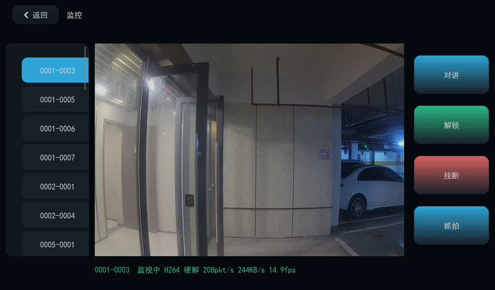
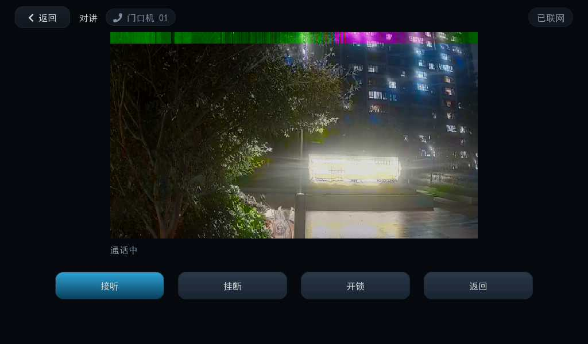
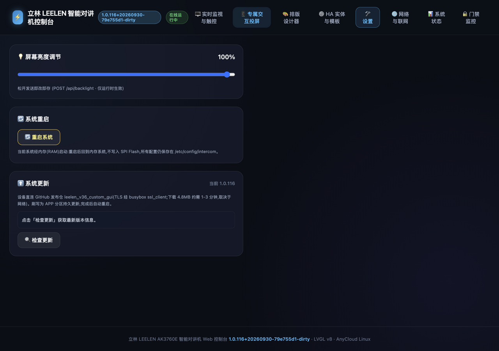
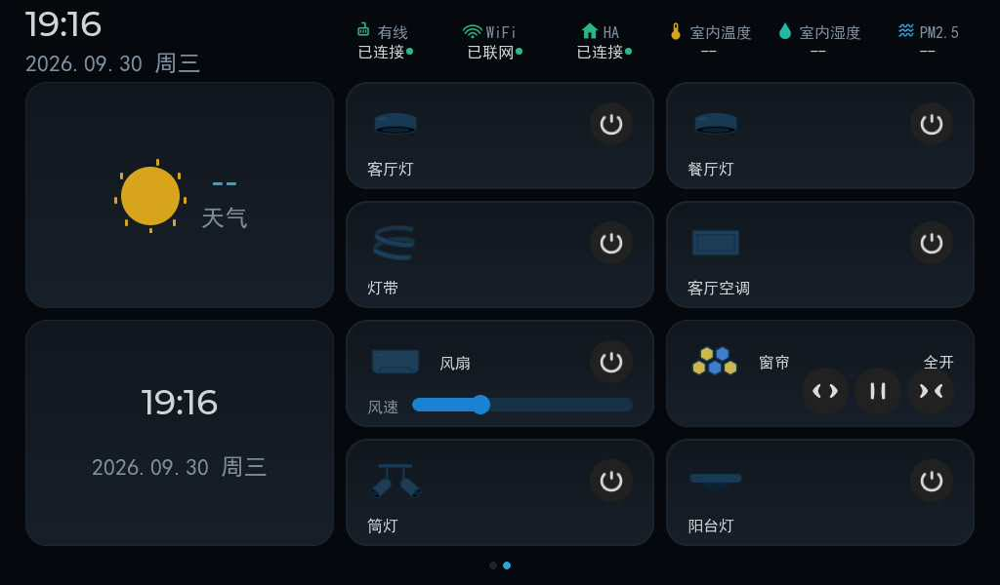

# LEELEN AK3760E Custom Firmware — 立林室内机自定义固件(发布仓)

为 **立林(LEELEN) 室内对讲机**(安凯 AK3760E / AnyCloud37E 平台)定制的应用固件,在原厂硬件上实现:

- **立林私有协议互通**:号码寻址 → 门口机**监视取流**(H.264 硬解上屏,实测 14.9fps)→ **双向对讲**(PCMA/AEC)→ **开门解锁**;被叫来电(振铃 + 来电画面 + 接听/挂断)
- **被叫来电视频**:门口机呼入接通后,对讲屏 640×360 显示门口机画面(H.264 硬解)
- **Web 控制台**(设备内置 8080):MJPEG 实时流、门禁列表/解锁/对讲、HA 实体浏览控制、Wi-Fi/有线设置、**在线更新**
- **Home Assistant 联动**:实体自动发现(≥1536)、WebSocket 实时状态、卡片绑定
- **屏端 UI**(LVGL v8.2):主页卡片、6-Tab 设置、门禁监控页、对讲/来电、呼叫记录

| 首页 | 门禁监控(H.264 硬解) | 对讲通话(来电视频) |
|---|---|---|
|  |  |  |

| Web 控制台 · 系统更新 | 本机摄像头抓拍 |
|---|---|
|  |  |

> 源码仓库:[snailll2/leelen_v36_app](https://github.com/snailll2/leelen_v36_app)(含互通协议文档 `docs/VENDOR_INTERCOM_PROTOCOL.md`)。
> 本仓库只放**运行时产物 + 版本信息**,供设备端在线更新使用。

## 在线更新(OTA)

设备固件 ≥ **1.0.115** 后,打开 Web 控制台 → **🛠️ 设置 → ⬆️ 系统更新 → 🔍 检查更新**:

1. 设备直连 GitHub 拉取本仓 `version.json`(多源:raw → ghfast → jsdelivr;源码见 `app/intercom/ic_ota.c`);
2. 发现新版本后一键下载(4.9MB,约 1-3 分钟)——设备网络受限(如 DNS 被代理劫持)时**自动切换浏览器中转**:由电脑浏览器下载后分块上传给设备;
3. MD5 校验通过 → 自动刷写 APP 分区(mtd6)→ 自动重启,新版本开机生效。全程无需拆机/串口。

`version.json` 字段:`version` 版本号 / `size`+`md5` 镜像校验 / `notes` 更新说明。

## 首次安装(旧固件/全新设备)

设备需与电脑同网段且 Web 可达(原厂固件自带 Web;或已开启 telnet):

```bash
git clone https://github.com/snailll2/leelen_v36_app && cd leelen_v36_app
bash imaging/release.sh                 # Docker 交叉编译 + 出厂镜像(自动升版本号)
bash imaging/flash_usr.sh <设备IP>      # 刷 APP 分区(FTP/nc + md5 门 + VERIFY OK + 回读复核)
```

更完整的构建/烧录/恢复文档见源码仓库 `imaging/README.md` 与 `docs/`。

## 仓库结构

```
├── README.md          ← 本文件
├── version.json       ← 版本信息(OTA 检查用)
├── usr.sqsh4.new      ← APP 分区镜像(squashfs,含 app/驱动/工具)
└── imgs/              ← 截图
```

## 已知边界

- 屏端视频解码默认走 VDEC 硬解(JPEG/H.264);高负载组合(推流+投屏轮询+抓屏并发)可能触发
  Web 假死,supervisor 会自动重启恢复,期间来电接听不受影响
- OTA 直连 GitHub 需要设备能解析并访问公网;DNS 被代理劫持的网络请保持电脑与设备同网段,
  走浏览器中转路径
- 本项目用于自有设备的互通研究,不含立林平台凭据;刷写有风险,请自备份原厂分区

## 许可

应用源码随源码仓库发布;SDK/闭源库归属原厂商。仅供学习与自有设备改造使用。
